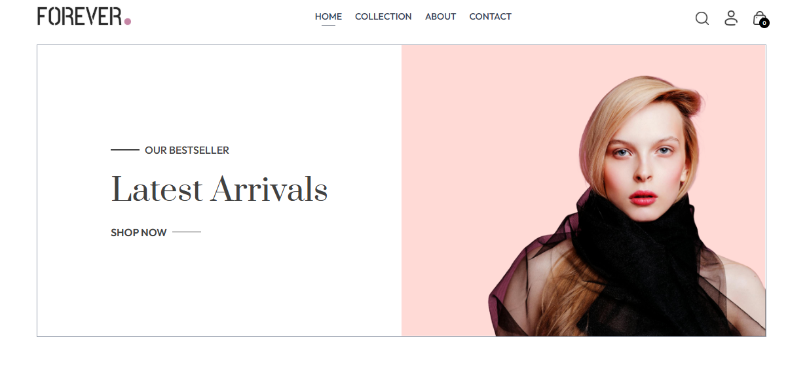
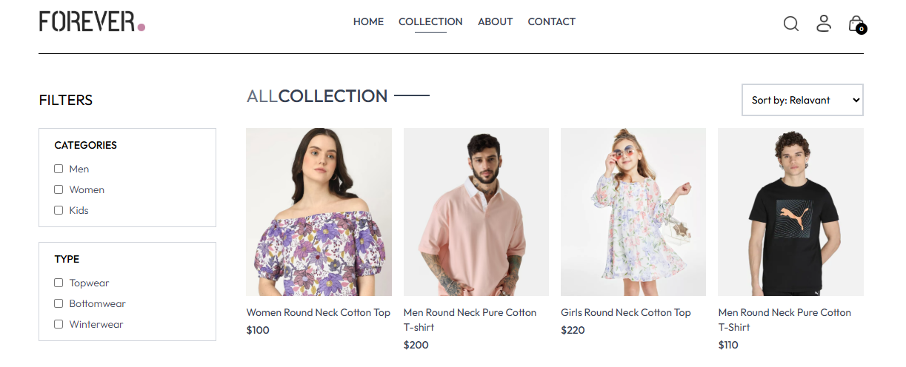
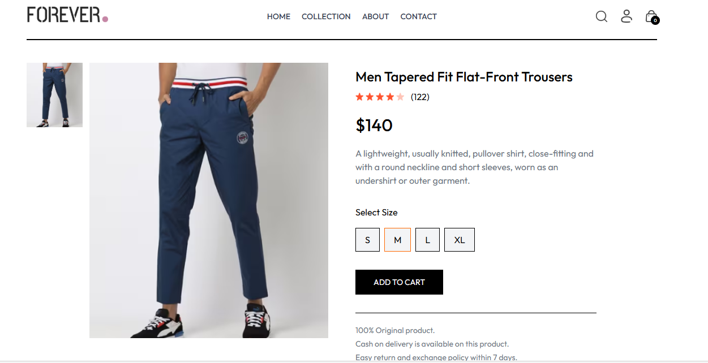
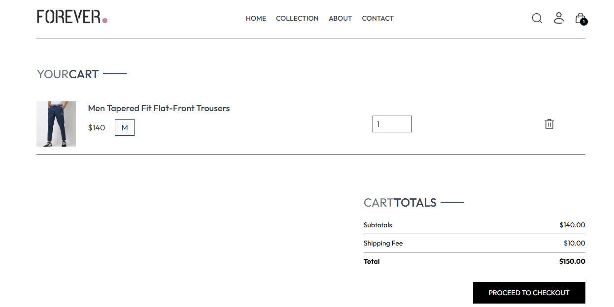
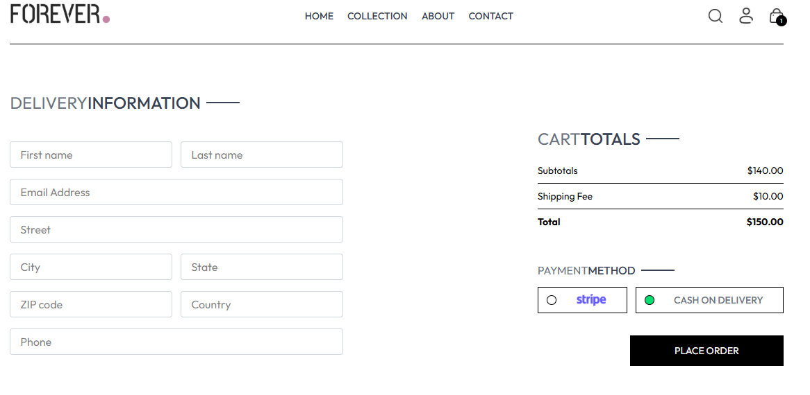
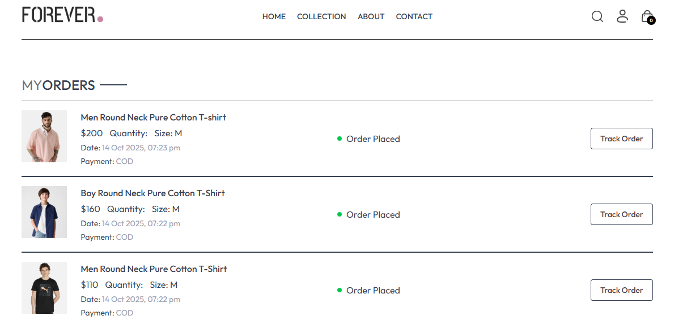
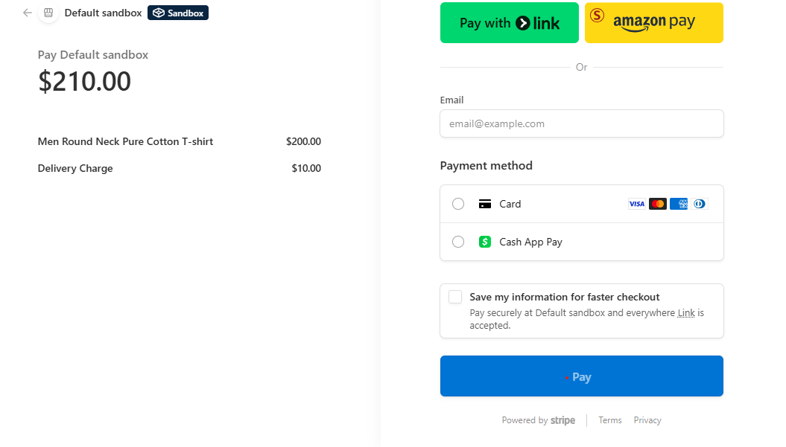
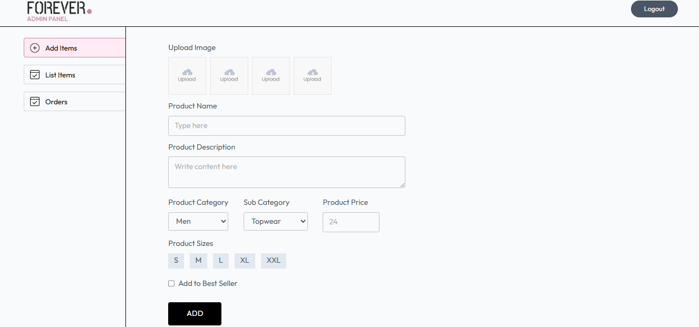
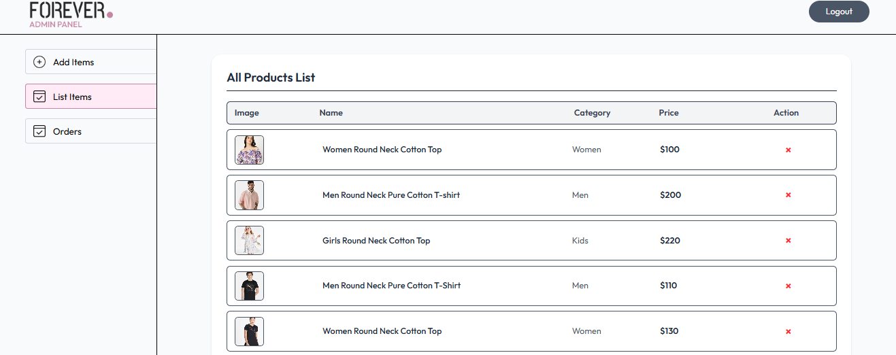
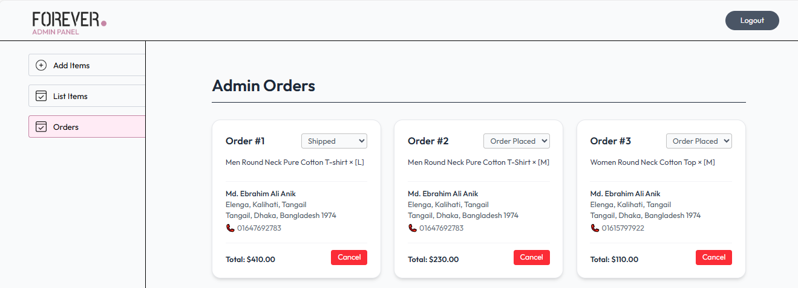

# 🛒 Full-Stack E-Commerce Website (MERN + Vite)

A fully functional, modern, and responsive **E-Commerce Website** built with the **MERN stack** — featuring authentication, product management, secure payments, and an intuitive admin dashboard.

---

## 🚀 Overview

This project provides a complete online shopping experience with user and admin roles, secure payment integration (Stripe + Cash on Delivery), and a fast, responsive frontend powered by **Vite + React**.

It’s designed to be scalable, secure, and easy to deploy.

---

## 🧩 Key Features

### 🖥️ Frontend (User Side)
- ✅ **Responsive Design** — fully optimized for desktop, tablet, and mobile.
- ✅ **Role-Based Access** — restricts admin pages for authorized users only.
- ✅ **Multiple Pages** — includes Home, Login, Register, Cart, About, and Contact.
- ✅ **Payment Integration** — supports both **Stripe** and **Cash on Delivery**.
- ✅ **Cart Management** — add, remove, and update products in real time.
- ✅ **Order Placement System** — complete checkout and order tracking.
- ✅ **Vite Integration** — for blazing-fast frontend performance.

---

### ⚙️ Backend (Server Side)
- 🔐 **JWT Authentication** — secure and stateless user sessions.
- 🔒 **Password Hashing** — implemented using **bcrypt**.
- 🧠 **Dynamic REST APIs** — built with **ExpressJS** and **Mongoose**.
- ☁️ **Image Uploads** — via **Cloudinary** and **Multer**.
- 💳 **Stripe Payment Gateway** — safe and easy payment handling.
- 🌿 **Environment Configuration** — using **dotenv**.
- 🔁 **Real-time Order Management** — create, list, and track orders.

---

### 🧑‍💼 Admin Panel
- 🔑 **Secure Admin Login**
- 🛍️ **Add / Update / Delete Products**
- 📦 **View & Manage All Orders**
- 💬 **Track Customer Purchases**
- 📊 **Dynamic Dashboard**

---

## 🛠️ Tech Stack

### **Frontend**
- ⚡ Vite + ReactJS  
- 🧭 React Router DOM  
- 📡 Axios  
- 🎨 Tailwind CSS  
- 🔔 React Toastify  

### **Backend**
- ⚙️ ExpressJS  
- 🧂 bcrypt  
- ☁️ Cloudinary + Multer  
- 🌐 CORS  
- 🔑 dotenv  
- 🪶 JSON Web Token (JWT)  
- 🍃 Mongoose (MongoDB ODM)  
- 🚀 nodemon  
- 💳 Stripe API  
- 🧰 validator  

---

## 📸 Screenshots
# User Images:
# Homepage

# Collection page

# Add to Cart

# Cart

# Check Out

# Orders

# Stripe payment:


# Admin Images:
# Add items

# Products

# Admin orders

---
# Live frontend:
[** Go to Live Frontend **](https://e-commerce-frontend-kappa-ten.vercel.app/login)
## ⚙️ Installation & Setup

### 🔧 Prerequisites
Ensure you have the following installed:
- Node.js (v16+)
- MongoDB (Local or Atlas)
- npm or yarn
- Stripe account & API keys
- Cloudinary account (for image uploads)

---

### 🖥️ Frontend Setup

```bash
cd client
npm install
npm run dev
```
## Backend Setup
```bash
cd server
npm install
npm run dev
```
## Admin Setup
```bash
cd admin
npm install
npm run dev
```
# Backend env file:
PORT=8000

MONGO_URL=your_mongodb_connection_string

CLOUDINARY_API_KEY=your_cloudinary_api_key

CLOUDINARY_SECRET_KEY=your_cloudinary_secret

CLOUDINARY_NAME=your_cloudinary_name

JWT_SECRET=your_jwt_secret

ADMIN_EMAIL=your_admin_email

ADMIN_PASS=your_admin_password

STRIPE_SECRET_KEY=your_stripe_secret_key

# Frontend env file:
VITE_SERVER_URL=http://localhost:8000

# Admin env file:
VITE_SERVER_URL=http://localhost:8000
